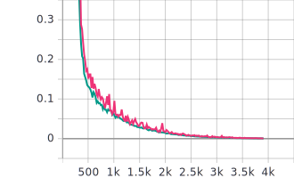

# DeepWay.v2
Autonomous navigation for blind people
# Steps
1. Collecting Training data.
2. Labelling training data (used LabelBox for it).
3. Downlading data from the exported .csv file from Labelbox
4. Training a segmentation model on the data
5. 

# Things to acheieve:
1. Collecting data
2. training a simple classifier
3. generating data for segmentation of roads and people
4. training UNET
5. running everything on nano
6. Generating lines(making your own lanes
7. pushing the person the leftmost lane
8. AAgar admi agle lane me aata hai to lane change
9. Navigation using GPS module

# Hardware requirements
1. Nvidia Jetson Nano.
2. Arduino nano.
3. 2 servo motors.
4. USB audio adapter(as jetson nano does not have a audio jack)
5. Ethernet cable
6. Power adapter for nvidia jetson nano
7. 3D printer.(Not very necessary)
8. A latop(Nvidia GPU preferred) or any cloud service provider.

# Software requirements
1. Ubuntu machine(16.04 preferred)
2. Install anaconda.
3. 

# Steps:
1. Collecting dataSet and Generating image masks.
    * I made videos of roads and converted those videos to jpg's. This way I collected a dataSet of approximately 10000 images.I collected images from left, right and center view. e.g: 
    
    
     
    * For Unet, I had to create binary masks for the input data, I used LabelBox for generating binary masks. (This took a looooooooot of time). A sample is as follows-> 
    
     
2. Model training
    * I trained a U-Net based model for road segmentation. 
    * The loss(pink:traning, green:validation) vs iterations curve is as follows.
    
    
    

# This is the project

# People to Thank
1. Army Institute of Technology (My college)
    * 3D printer
    * Ever Lasting Support
2. 3D printing
    * Prof. Avinash Patil
    * Sangam Kumar Padhi
    * Sahil
    * Priyanshu
3. Data Labelling
4. Nvidia
    * Nvidia Jetson Nano
5. LabelBox
    * For providing me with the free license of their **Amazing Prodcut**.

# References
1. [Pytorch](https://pytorch.org/)
2. [PyimageSearch](https://www.pyimagesearch.com/)
3. [Pytorch Community](https://discuss.pytorch.org/)
4. [AWS](https://aws.amazon.com/)
5. [U-Net](https://arxiv.org/pdf/1505.04597.pdf)
6. [U-Net implementation(usuyama)](https://github.com/usuyama/pytorch-unet)
7. [U-Net implementation(Heet Sankesara)](https://towardsdatascience.com/u-net-b229b32b4a71)

