## DEEPWAY V2
### Autonomous navigation for blind people.
  

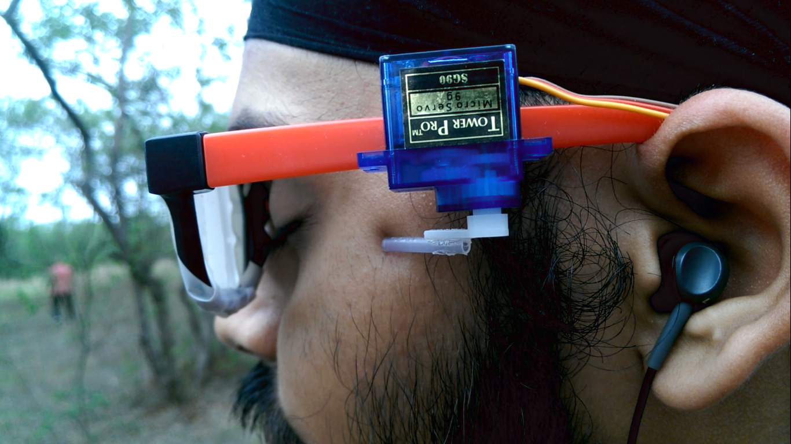

### Different versions of this project
* **V1** [github](https://github.com/satinder147/DeepWay), [video](https://www.youtube.com/watch?v=qkmU8mN0LwE)
* **V2** Github: Master branch of this repo, [15 minute video](https://youtu.be/3aPsFYoD9pA), [DeepWay v2 -trailer](https://www.youtube.com/watch?v=ks8Rsd65RnM)
* **V2.1** Github: Depthai branch of this repo. [Explanation video](https://www.youtube.com/watch?v=ucMvhb73W8A&feature=youtu.be)
### A question you may have in mind
##### If I already had a repository, why make another ?
* Since V1 was based on keras, and I don't like tensorflow much, so for more control I have shifted to pytorch.  
* It is complete redesign.

### How is it better than others:
1. Cost effective: This version costs approx **400** dollars.
2. Blind people generally develop other senses like hearing very well. Taking away one of their senses by using earphones   would not have been nice so I am providing information to the blind person using haptic feedback.
3. Everything runs on a edge device .i.e on the depth-ai kit.

### Hardware requirements
1. Depth ai kit
2. Arduino nano.
3. 2 servo motors.
4. raspberry pi or any other host device. (Will not be required once depthai kit GPIO support)
5. Power adapter for depth ai kit.
6. 3D printer.(Not necessary)
7. A laptop(Nvidia GPU preferred) or any cloud service provider.

### Installation instruction
1. Clone this repository
2. Install anaconda.
3. Install the required dependencies. Some libraries like pytorch, opencv would require a little extra attention. 
> conda env create -f deepway.yml
4. Download the segmentation model from [here](https://drive.google.com/file/d/108qQlXXWIz-e9go1HsL4GkXm1YP20r0S/view?usp=sharing) and create a directory inside deepway folder named "trained_models" and put it there.
5. Change the COM number in the arduino.py file according to your system.
6. Connect the Arduino nano.
7. Compile and run arduino Nano code in the arduino nano.
8. Run runner.py

### 1. Collecting dataSet and Generating image masks.
I made videos of roads and converted those videos to jpg's. This way I collected a dataSet of approximately 10000 images.I collected images from left, right and center view(So automatically labelled). e.g: 
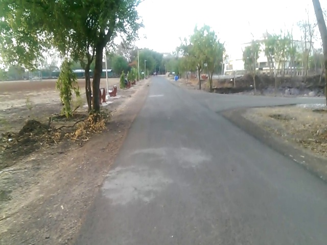
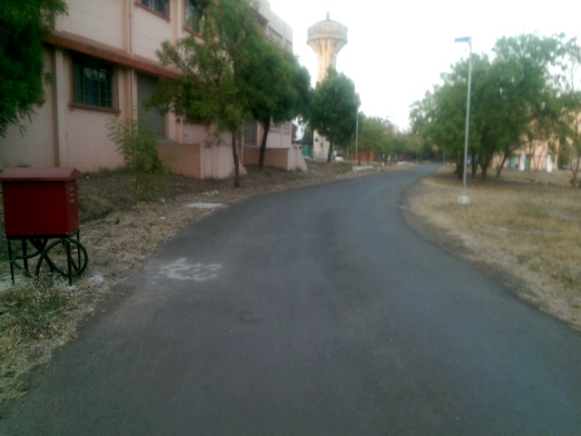
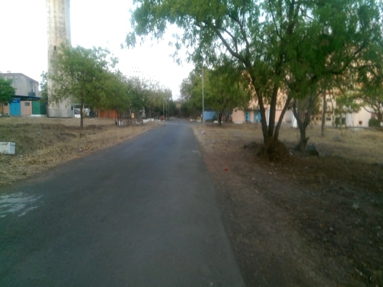   
    
For Unet, I had to create binary masks for the input data, I used LabelBox for generating binary masks. (This took a looooooooot of time). A sample is as follows->  
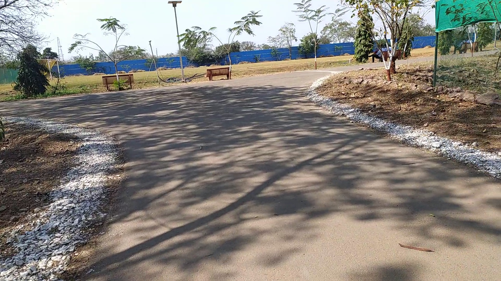
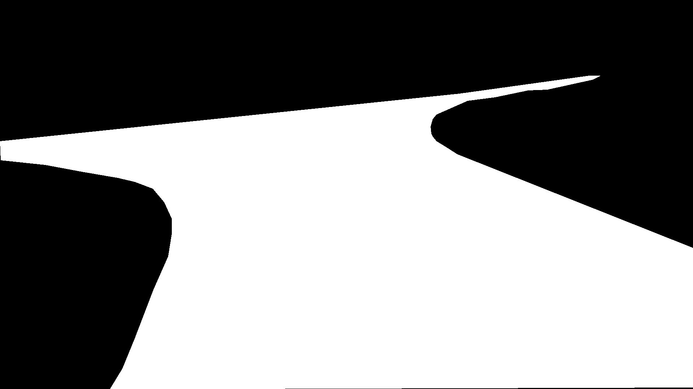   

**For downloading the labelled data from Labelbox, I have made a small utility named "downloader.py"**
   
### 2. Model training
I trained a lane detection model(Now deprecated) which would predict the lane(left,center,right) I am walking in.  
The loss vs iteration curve is as follows:

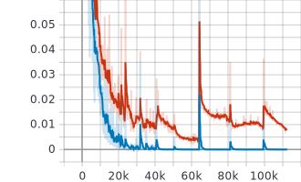

I trained a U-Net based model for road segmentation on Azure.
The loss(pink: Train, green: Validation) vs iterations curve is as follows. 
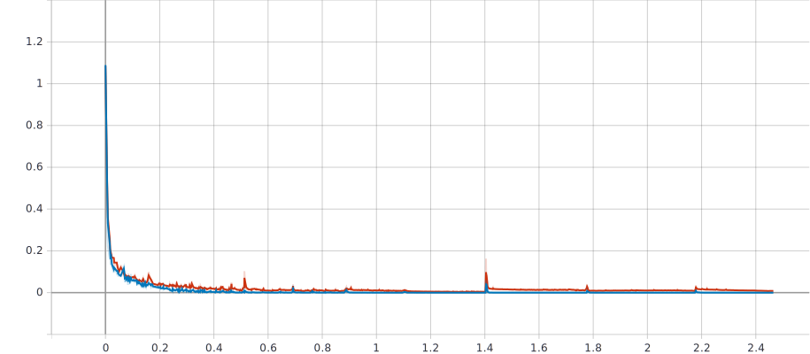
 
**though the loss is less the model does not perform well** 
***I trained a model in keras with a different architecture performs really well
Loss vs iterations curve is:***
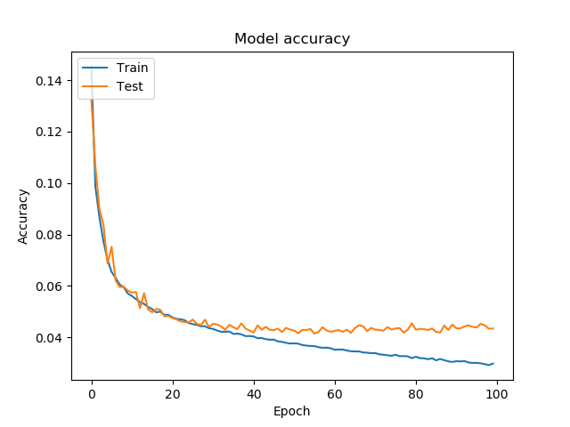

### 3. 3D modelling and printing
My friend Sangam Kumar Padhi helped me with CAD model. You can look at it [here](https://github.com/satinder147/DeepWay.v2/blob/master/3D%20model/model.STL)

### 4. Electronics on the spectacles
The electronics on the spectacles are very easy. It is just two servo motors connected with a ardunio nano. The arduino nano receives signal from the jetson(using pyserial library), and Arduino Nano controls the servo motors.  
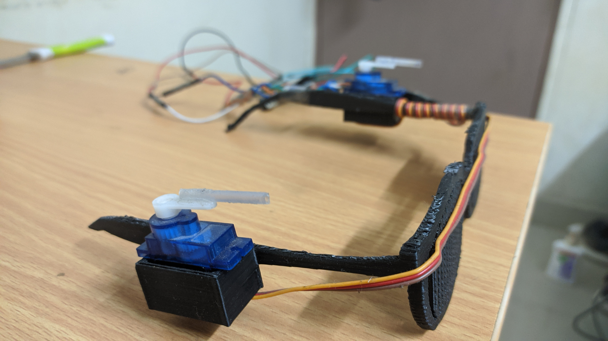
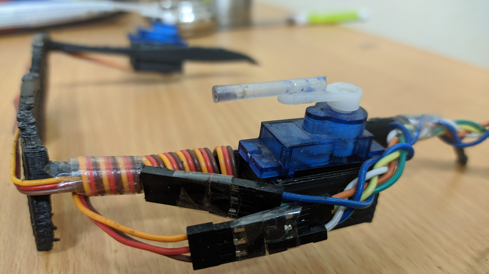

#### FLOW
1. Get camera feed.
2. Run the image through the road segmentation model.
3. Get lane lines from the segmentation mask.
4. Get depth of all the objects in front of the person.
5. Get all the objects in current lane.
6. Plot all the objects on a 2d Screen.
7. Push the person to the left lane (As per indian traffic rules)
8. Use A-Star algorithm to get a path from current location to 2 meters ahead while maintaining distance from objects.
9. Inform the user about all the navigation instructions by using the SERVO motors.

#### Things to be added or can be improved
1. Instead of using naive A-star use one which does not involve sharp turns.
2. Find some efficient way than A-star.
3. Try fitting a 3 degree polynomial to the trajectory to get smooth turns.
4. Train a segmentation model for depth-ai, so that the complete neural network inference runs on the device.
5. Predicting where the pedestrians are going to be in future time will help plan better paths.
6. Trajectory planning is same for all types of objects right now, but trajectories can be different based on the size and speed of the object.
7. Region around a object also has to be considered.
# People to Thank
1. **Army Institute of Technology (My college).**
2. **Prof. Avinash Patil,Sangam Kumar Padhi, Sahil and Priyanshu for 3D modelling and printing.**
3. **Shivam sharma and Arpit for data labelling.**
4. **Luxonis for providing a free depth ai kit**
5. **LabelBox: For providing me with the free license of their **Amazing Prodcut**.**
6. **Luxonis slack channel**

# References
1. [Luxonis api reference](https://docs.luxonis.com/api/)
2. [PyimageSearch](https://www.pyimagesearch.com/)
3. [Pytorch Community, special mention @ptrblck](https://discuss.pytorch.org/)
4. [U-Net](https://arxiv.org/pdf/1505.04597.pdf)
5. [U-Net implementation(usuyama)](https://github.com/usuyama/pytorch-unet) 
6. [U-Net implementation(Heet Sankesara)](https://towardsdatascience.com/u-net-b229b32b4a71)
7. [Social distancing app](https://github.com/luxonis/depthai-experiments/tree/master/social-distancing)
8. [Advanced lane detection-Eddie Forson](https://towardsdatascience.com/teaching-cars-to-see-advanced-lane-detection-using-computer-vision-87a01de0424f)

# Citations

> Labelbox, "Labelbox," Online, 2019. [Online]. Available: https://labelbox.com

# Liked it
Tell me if you liked it by giving a star. Also check out my other repositories, I always make cool stuff. I even have a youtube channel "reactor science" where I post all my work.

# Read about v1 at:
1. [Geospatial Magazine](https://www.geospatialworld.net/blogs/now-visually-impaired-can-navigate-easily-with-deepway/)
2. [Hackster](https://blog.hackster.io/navigation-glasses-gently-poke-you-in-the-right-direction-21acc16c8b14)
3. [Anyline](https://anyline.com/news/3-inspiring-ai-projects-we-love/)
4. [Arduino blog](https://blog.arduino.cc/2018/08/20/deepway-helps-the-visually-impaired-navigate-with-a-tap/)
