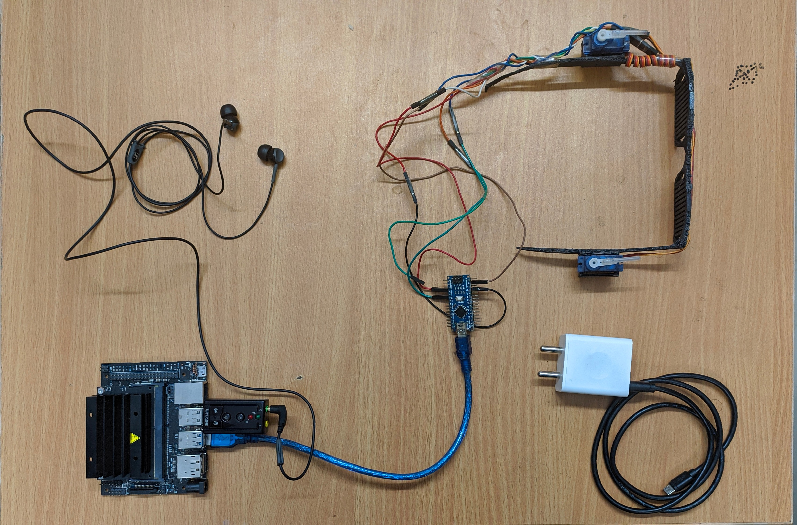

# DEEPWAY V2
Autonomous navigation for blind people.
This project is version 2 of [deepWay](https://github.com/satinder147/DeepWay). You can have a look at this [video](https://www.youtube.com/watch?v=qkmU8mN0LwE).

# Hardware requirements
1. Nvidia Jetson Nano.
2. Arduino nano.
3. 2 servo motors.
4. USB audio adapter(as jetson nano does not have a audio jack)
5. Ethernet cable
6. Power adapter for nvidia jetson nano
7. 3D printer.(Not necessary)
8. A latop(Nvidia GPU preferred) or any cloud service provider.

# Software requirements(If running on Laptop)
1. Ubuntu machine(16.04 preferred).
2. Install anaconda.
3. Install the required dependencies. Some libraries like pytorch, opencv would require a little extra attention.<br>
```conda env create -f deepWay.yml```
4. You can not clone the repository.
5. Change the COM number in the arduno.py file according to your system.
6. Connect the Ardunio nano and USB audio adapter to your PC. 
7. Change CAM to video path instead of 0 for running the system on video.
8. Download the weights and save it in checpoints/
9. change name of weight in blindrunner.py
10. Run blindrunner.py

# Software Requirements(Jetson nano)
1. Follow [these](https://developer.nvidia.com/embedded/learn/get-started-jetson-nano-devkit) instructions for starting up with Jetson nano.
2. For connecting headless with jetson nano(using ethernet cable). <br>
```
ifconfig
Check inet addresss
nmap -sn inet_address/24 --> will return live ip address.
ssh machine_name@ip
Enter password
Now you can connect switch on desktop sharing
Now connect to jetson using Reminna.

```
3. Now install all the required dependicies. 

### 1. Collecting dataSet and Generating image masks.
I made videos of roads and converted those videos to jpg's. This way I collected a dataSet of approximately 10000 images.I collected images from left, right and center view. e.g:<br>


<br>  
    
For Unet, I had to create binary masks for the input data, I used LabelBox for generating binary masks. (This took a looooooooot of time). A sample is as follows-><br> 

<br>  
   
### 2. Model training
I trained a U-Net based model for road segmentation on Azure.
The loss(pink:traning, green:validation) vs iterations curve is as follows.<br>

<br>
### 3. 3D modelling and printing
My friend Sangam Kumar Padhi helped me with CAD model. You can look at it [here](https://github.com/satinder147/DeepWay.v2/blob/master/3D%20model/model.STL)

### 4. Electronics on the spectacles
The electronics on the spectacles are very easy. It is just two servo motors connected with a ardunio nano. The arduino nano receives signal from the jetson(using pyserial library), and Arduino Nano controls the servo motors. <br>



# TODO
- [x] Collect training data.
- [x] Train a lane detection model.
- [x] Add servo motors feedback support.
- [x] Add sound support.
- [x] 3D print the spectacles.
- [x] Train U-Net for doing a lot of other stuff(like path planing).
- [ ] Improve U-Net accuracy.(The loss is very low, but the model does not come up to my expectations.
- [ ] Drawing Lanes.
- [ ] Optimizing everything to run even faster on Jetson nano.(conversion of models into Tensorrt).
- [ ] Adding G.P.S. support for better navigation.
- [ ] Adding path planning.
- [ ] Adding face recognition support(I have a [face_recognition](https://github.com/satinder147/Attendance-using-Face) repository, so most of the work is done, but I think face recognition should be added after we perfect the navigation part.)


# People to Thank
1. Army Institute of Technology (My college).
2. Prof. Avinash Patil,Sangam Kumar Padhi, Sahil and Priyanshu for 3D modelling and printing.
3. Shivam sharma and Arpit for data labelling.
4. Nvidia for providing a free jetson kit.
5. LabelBox: For providing me with the free license of their **Amazing Prodcut**.

# References
1. [Pytorch](https://pytorch.org/)
2. [PyimageSearch](https://www.pyimagesearch.com/)
3. [Pytorch Community](https://discuss.pytorch.org/)
4. [AWS](https://aws.amazon.com/)
5. [U-Net](https://arxiv.org/pdf/1505.04597.pdf)
6. [U-Net implementation(usuyama)](https://github.com/usuyama/pytorch-unet)
7. [U-Net implementation(Heet Sankesara)](https://towardsdatascience.com/u-net-b229b32b4a71)

